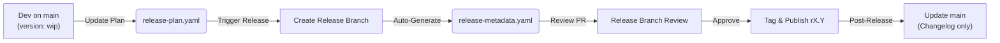

# CAMARA Release Process

This document describes the release process for CAMARA API repositories. The process automates checking compliance of the API repository to the release guidelines using metadata-driven GitHub workflows.

## 1. Objectives

The CAMARA release process aims to:
- **Automate** release artifact generation (CHANGELOGs, release notes, etc.) to reduce manual effort.
- **Enforce consistency** across all API repositories using structured metadata.
- **Ensure clear separation** between work-in-progress development and official releases.
- **Simplify compliance** with CAMARA API versioning and readiness standards.

## 2. API Version Lifecycle & Release Tracks

### The API Version Lifecycle
The lifecycle of an API version progresses through distinct states:
- **Draft / In-Development**: All work targets `main`. The `info.version` is kept as `wip`.
- **Alpha** (Optional): An early version (`x.y.z-alpha.m`) for initial feedback.
- **Release Candidate** (Mandatory): A more stable pre-release version (`x.y.z-rc.n`) to verify readiness. All public versions must be preceded by at least one Release Candidate.
- **Public**: The official, content-frozen API version. Such a version is called:
    - **Initial (`0.y.z`)**: For new APIs during rapid development.
    - **Stable (`x.y.z`)**: For mature APIs with strictly managed breaking changes.

### Release Tracks
An API repository can be released using one of two tracks:
- **Sandbox (Independent)**: 
    - Decoupled from CAMARA-wide release schedules. 
    - Allows releases at any time, ideal for new APIs or fast iteration.
- **Meta-Release (Coordinated)**: 
    - Aligned with CAMARA-wide milestones (e.g., Spring/Fall meta-release).
    - Must adhere to strict deadlines (code freeze, etc.) and alignment with Commonalities and ICM.

## 3. Terminology

| Term | Definition |
|------|------------|
| **Release Track** | Determines how an API repository will be released: `meta-release` (aligned with CAMARA meta-release milestones), `sandbox` (independent), or `none`. |
| **Meta-Release** | A coordinated set of public API version releases across CAMARA (e.g., "Fall25"), aligned with Commonalities and ICM versions. |
| **Pre-Release** | The release of an alpha (`x.y.z-alpha.m`) or release-candidate (`x.y.z-rc.n`) version. Not for commercial use. |
| **Public Release** | The release of a stable (`x.y.z`, x>=1) or initial (`0.y.z`) version for commercial use. |
| **Release Tag** | A GitHub tag for the repository release (e.g., `r4.1`), distinct from individual API SemVer versions. |
| **Release Readiness** | The repository's declared state for its release (e.g., `pre-release-alpha`, `public-release`). This state governing which automated validation checks will be applied to the repository content to assess if it can be released. |

## 4. The Release Workflow

The release process follows a structured 5-step workflow driven by metadata.



### Step 1: Continuous Development & Planning (on `main`)
- **Development**: All code changes target `main`. The `info.version` in OpenAPI files is kept as `wip` to avoid merge conflicts.
- **Planning**: Maintainers update `release-plan.yaml` on `main` to declare the target version and status for the next release.
    - CI validates that the code meets the requirements for the declared status (e.g., if you plan a `public` release, CI checks for broken links or missing docs).

### Step 2: Triggering a Release
- Maintainers trigger a release by adding a label (e.g., `trigger-release`) to an issue or dispatching a workflow.
- **Automation** creates a dedicated release branch (e.g., `release/r1.2`).
- The automation calculates the exact versions for all APIs based on their history and the `release-plan.yaml`.

### Step 3: Release Preparation & Review
- A **Release Preparation PR** is automatically created against the release branch.
- This PR contains:
    - `release-metadata.yaml`: The frozen history of what is being released.
    - Updated API and Test definition files with concrete versions (replacing `wip`).
    - Generated CHANGELOG.md.
- Maintainers review this PR. If changes are needed (e.g., to the changelog text), they are made here.

#### Handling Review Feedback
If substantive issues are found during review, they must be fixed on `main`, NOT on the release branch. The release branch is for release artifacts only.

1.  **API or Test Definitions Incorrect**:
    - **Problem**: The API or Test definition in the release does not match what was intended, or bugs were found.
    - **Action**: 
        1.  Fix the issue on `main` via a standard Pull Request.
        2.  Close the Release PR and delete the release branch.
        3.  Re-trigger the release.
    - **Why?**: Fixes must exist on `main` for future releases. The release branch should be treated as ephemeral until published.

2.  **Wrong Version Number**:
    - **Problem**: The calculated version is wrong (e.g., `1.0.1` instead of `1.1.0`) because the `target_version` in the plan was incorrect.
    - **Action**:
        1.  Close the Release PR and delete the release branch.
        2.  Update `release-plan.yaml` on `main` with the correct `target_version`.
        3.  Re-trigger the release.

3.  **Abandoning a Release**:
    - **Action**: Simply close the Release PR and delete the release branch. No released tags are created, and `main` remains unaffected.

### Step 4: Tagging & Publication
- Once the Release Preparation PR is merged, the release branch is tagged (e.g., `r1.2`).
- GitHub Actions automatically:
    - Build release artifacts (OpenAPI bundles).
    - Create the GitHub Release.

### Step 5: Post-Release Sync
- A PR is automatically created back to `main` to:
    - Append the new entry to `CHANGELOG.md`.
    - Update `README.md` with links to the new release.
- **Note**: The `release-plan.yaml` on `main` is NOT reset; it remains as the starting point for the next cycle.

## 5. Metadata Reference

The process relies on two key files.
> **Note**: The YAML blocks below are **examples**. For detailed recipes, see the [Release Planning Cookbook](Release_Planning_Cookbook.md). For the detailed definitions of all properties, refer to the [JSON Schemas](../artifacts/metadata-schemas/schemas/).

### `release-plan.yaml` (Living Plan)
Located in `{repo_root}/release-plan.yaml`. Owned by codeowners. Defines **what you want to release**.

```yaml
repository:
  release_track: meta-release
  meta_release: Fall25
  release_tag: r1.2
  release_readiness: pre-release-rc

apis:
  - api_name: location-verification
    target_version: 1.1.0  # The SemVer you are aiming for
    api_status: rc         # alpha, rc, or public
```

### `release-metadata.yaml` (Frozen History)
Located in `{repo_root}/release-metadata.yaml` on release tags. Generated by automation. Defines **what was released**.

```yaml
repository:
  release_tag: r1.2
  release_date: 2025-09-15
  src_commit_sha: abc1234
  
apis:
  - api_name: location-verification
    api_version: 1.1.0-rc.1
```

## 6. Versioning & Branching Rules

### Branch Strategy
- **`main`**: Always contains the latest validated code. Versions are `wip`.
- **`release/rX.Y`**: Short-lived branches for stabilizing a specific release.
- **`maintenance-rX`**: Long-lived branches for patching older major releases (e.g., `maintenance-r1`).

### Semantic Versioning (SemVer)
CAMARA follows strictly [Semantic Versioning 2.0.0](https://semver.org/).
- **MAJOR**: Breaking changes.
- **MINOR**: New features (backward compatible).
- **PATCH**: Bug fixes (backward compatible).

**Automation Rule**: You declare the `target_version` (Major.Minor.Patch) in the plan. The automation appends pre-release identifiers (`-alpha.X`, `-rc.Y`) automatically based on what has been released before.

### API Version in URL
- For `x >= 1` (Stable): URL is `v{MAJOR}` (e.g., `/my-api/v1`).
- For `x = 0` (Initial): URL is `v0.{MINOR}` (e.g., `/my-api/v0.2`).
- **Automation Rule**: The CI ensures the `servers.url` in your OpenAPI file matches this strictly.

## 7. Supporting Documents
- [Release Planning Cookbook](Release_Planning_Cookbook.md): Common recipes for configuring `release-plan.yaml`.
- [API Readiness Checklist](API-Readiness-Checklist.md): List of requirements for different readiness levels.
- [Commonalities Versioning](https://github.com/camaraproject/Commonalities/blob/main/documentation/CAMARA-API-Design-Guide.md#7-versioning): Detailed versioning rules.
