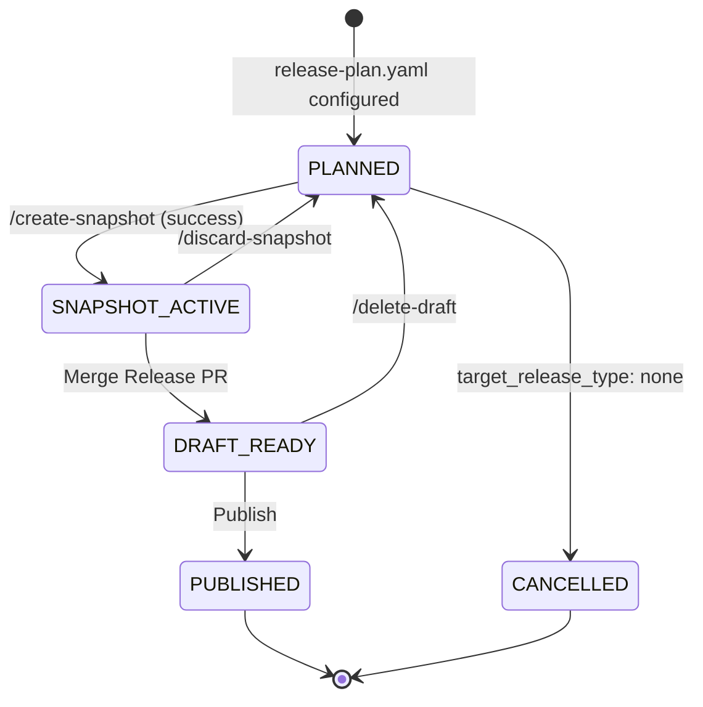

# Release Creation Process (C2) — Detailed Design (MVP)

> **Scope:** This document details the **release creation process** for CAMARA API repositories — from triggering a release through Release PR merge and draft release creation. It covers [Issue #354: C2 Automated Release Branch Creation](https://github.com/camaraproject/ReleaseManagement/issues/354) and partially extends into [Issue #355: C3 Release Tag and Artifact Creation](https://github.com/camaraproject/ReleaseManagement/issues/355) for the draft release and manual publication steps in MVP.

---

## Executive Summary

This document details the **release creation process** for CAMARA API repositories — the process from deciding to release through publication.

### Core Mental Model

> *Immutable, automation-owned **release snapshots** derived from `main`, with cheap, repeatable attempts per release number (`rX.Y`), and human review limited to non-mechanical content via PRs that target the snapshot branch — never `main`.*

### Core Principles

1. **Snapshot-centric model**: Releases are created via immutable, automation-owned *snapshots* identified by `rX.Y-<shortsha>`. Multiple attempts per release number are normal and expected — discarding a snapshot is routine, not failure.

2. **Slash commands for control**: Users express intent via slash commands (`/create-snapshot`, `/discard-snapshot`, `/delete-draft`). Labels reflect system state only. This separates user intent from system state and enables clear audit trails.

3. **Dual-branch separation**: Each snapshot uses two branches — a protected *snapshot branch* for mechanical changes (versions, URLs) and an editable *release-review branch* for documentation (e.g. CHANGELOG). The release-review branch is merged into the snapshot branch via Release PR. This prevents accidental corruption of version fields by construction.

4. **Repository artifacts as source of truth**: The `release-metadata.yaml` on the snapshot branch is the authoritative record of the release attempt, including base commit SHA. The Release Issue (a dedicated GitHub issue for tracking the release) serves as UI, trigger surface, and audit trail — not the state store.

5. **Bot as guided UI**: Every automation response shows current state, key parameters, and all valid next actions — turning the bot into an interactive guide rather than just a log.

### Key Benefits

- **Safe by design**: Mechanical fields protected structurally, not by policy
- **Cheap retries**: Discarding and recreating snapshots is fast and normal
- **Clear accountability**: Explicit commands with audit trail
- **Reduced confusion**: One active snapshot per release, clear state labels
- **Human control**: Automation creates drafts; humans publish
- **One-step happy path**: Single `/create-snapshot` command validates and creates the snapshot branch, the release-review branch, and the Release PR

### Deviations from Current Concept

| Aspect | Concept Document | This Design |
|--------|------------------|-------------|
| Branch naming | `release/rX.Y` | `release-snapshot/rX.Y-<shortsha>` (SHA-based) |
| Trigger mechanism | Label (`trigger-release`) | Slash command (`/create-snapshot`) in the Release Issue |
| Validation | Implicit in trigger | Preflight validation within `/create-snapshot` |
| PR structure | Single release prep PR | Dual-branch: release-snapshot (mechanical) + release-review (documentation); Release PR merges review into snapshot |
| Bot responses | Not specified | Mandatory structure with next-steps guidance |
| Issue closure | Not specified | Blocked in SNAPSHOT ACTIVE and DRAFT READY states |
| Tag creation | After Release PR merge | Only at final publication |
| Source of truth | Not specified | `release-metadata.yaml` on snapshot branch |

These refinements are **compatible extensions** to the concept. A change request to update the concept document will follow after design acceptance.

---

**Status:** MVP Design — Recommendations for review.

---

## Table of Contents

1. [User Perspectives and Requirements](#1-user-perspectives-and-requirements)
2. [Design Principles](#2-design-principles)
3. [State Model](#3-state-model)
4. [Detailed Design](#4-detailed-design)
5. [Bot UX Contract](#5-bot-ux-contract)
6. [Permissions and Enforcement](#6-permissions-and-enforcement)
7. [Open Questions](#7-open-questions)
8. [Future Enhancements (Post-MVP)](#8-future-enhancements-post-mvp)

---

## 1. User Perspectives and Requirements

### 1.1 Repository Maintainer

**Role:** Owns the API content and decides when it's ready for release.

**Requirements:**

| ID | Requirement | Rationale | MVP |
|----|-------------|-----------|-----|
| M1 | Know what release configuration is active | Avoid confusion about versions, statuses | ✅ |
| M2 | See calculated API versions before triggering | Understand what will be released (e.g., `3.2.0-rc.2`) | ❌ Post-MVP |
| M3 | Control when release process starts | Release when ready, not before | ✅ |
| M4 | Ability to abort and retry | Handle issues found during review | ✅ |
| M5 | Refine CHANGELOG during review | Manually add information that automation can't generate | ✅ |
| M6 | Not accidentally break mechanical fields | Version numbers, URLs must be protected | ✅ |
| M7 | Clear feedback on what's blocking | Actionable error messages | ✅ |
| M8 | Preserve work across retries | Don't lose CHANGELOG edits on discarded snapshots | ✅ |
| M9 | Know current state of release process | Where are we? What's next? Which snapshot is current? | ✅ |
| M10 | Simple, minimal required actions | Reduce overhead on maintainers | ✅ |

**Note:** M2 (preview before triggering) is addressed by the Preview/Dry-Run extension (Section 8.1). In MVP, calculated versions are shown immediately after `/create-snapshot` succeeds.

### 1.2 Release Manager

**Role:** Coordinates releases across repositories, ensures meta-release alignment.

**Requirements:**

| ID | Requirement | Rationale |
|----|-------------|-----------|
| R1 | Visibility into release status across repos | Coordination for meta-releases |
| R2 | Verify dependencies are published | Can't release if dependencies missing |
| R3 | Human checkpoint before publication | Prevent accidental public releases |
| R4 | Override capability for stuck releases | Handle exceptional situations |
| R5 | Audit trail of release decisions | Traceability for governance |
| R6 | Know which commit a release is based on | Reproducibility |
| R7 | See current vs. discarded snapshots | Know which attempt is active |

### 1.3 Governance

**Role:** Ensures process integrity, prevents errors, maintains consistency.

**Requirements:**

| ID | Requirement | Rationale |
|----|-------------|-----------|
| G1 | Release configuration comes from `release-plan.yaml` | Single source of truth |
| G2 | Configuration scope frozen during active snapshot | Prevent drift and confusion |
| G3 | Mechanical changes are tamper-proof | Version numbers must be correct |
| G4 | Clear separation: content vs. configuration | Metadata PRs separate from implementation PRs |
| G5 | Immutable release snapshots | What you reviewed is what you release |
| G6 | All releases traceable to source commit | Audit and reproducibility |
| G7 | Consistent process across repositories | Predictable, learnable process |

---

## 2. Design Principles

### 2.1 Issue-Based Release Tracking

**Principle:** Each release (`rX.Y`) is tracked via a dedicated Release Issue (GitHub issue) that serves as the UI, command surface, and audit trail across all snapshot attempts.

**Addresses:** M1, M9, R1, R5, R7

**Rationale:**
- Provides visible, searchable tracking artifact
- Natural place for discussion and decisions
- Links to PRs, snapshots, and releases
- Preserves history across multiple snapshot attempts
- Shows which snapshot is current vs. discarded
- Familiar GitHub pattern for maintainers

**Note:** The Release Issue is NOT the state store. State is derived from repository artifacts (snapshot branch existence, draft release existence).

### 2.1.1 Release Issue Ownership

**Principle:** Release Issues are **workflow-managed GitHub artifacts**.

- Created automatically by automation
- Updated automatically when state changes
- Used as UI, command surface, and audit trail
- **Not** manually created or adopted by the workflow

> "Release Issues are workflow-managed artifacts. Issues not created by automation are out of scope for the release workflow."

**Implications:**
- Automation interacts only with issues it created
- Manually created issues are ignored by automation
- No behavior defined for adopting or rewriting manual issues

### 2.1.2 Human Intent Signal

**Principle:** Human intent to plan a release is expressed **exclusively** through changes to `release-plan.yaml` merged into the base branch.

> "The Release Issue reflects this intent; it does not define it."

**Implications:**
- Manual Release Issue creation is NOT an intent signal
- Issue existence does NOT imply release intent
- `release-plan.yaml` with `target_release_type ≠ none` is the sole source of release intent

### 2.2 Slash Commands for User Intent, Labels for System State

**Principle:** User actions are expressed via **slash commands** in Release Issue comments. Labels on the Release Issue represent **system state only**, not actions. User commands create or remove release-snapshot branches (`release-snapshot/rX.Y-<sha>`) and create release-review branches (`release-review/rX.Y-<sha>`).

**Addresses:** M3, M4, M10, R4

**Rationale:**
- **Commands express intent**: What the user wants to do
- **Labels express state**: What state the system is in
- Commands are ephemeral (do not persist as labels)
- Prevents label accumulation and ambiguity
- Commands can be reused
- Clear audit trail of who requested what action

**MVP Command Set:**

| Command | Meaning |
|---------|---------|
| `/create-snapshot` | Validate current HEAD, then create snapshot branch (`release-snapshot/rX.Y-<sha>`), release-review branch (`release-review/rX.Y-<sha>`), and Release PR |
| `/discard-snapshot <reason>` | Discard the active snapshot attempt; keeps release-review branch and closes Release PR |
| `/delete-draft <reason>` | Delete a prepared draft release before publication |

### 2.3 Repository Artifacts as Source of Truth

**Principle:** The `release-metadata.yaml` file on the snapshot branch is the authoritative record for a release attempt. Bot feedback is derived from repository artifacts, not issue-stored variables.

**Addresses:** G5, G6, R6

**Rationale:**
- Ensures reproducibility and auditability from repo artifacts
- Avoids "issue as state store" complexity
- Single source of truth for base commit SHA, snapshot identity, release configuration
- State derivable from artifact existence (snapshot branch, draft release)

### 2.4 Separation of Mechanical and Reviewable Content

**Principle:** Mechanical changes (version numbers, URLs) are committed directly to the snapshot branch and cannot be edited via PR. Only documentation (CHANGELOG, README) is reviewable in the Release PR via a separate release-review branch.

**Addresses:** M5, M6, G3

**Rationale:**
- Prevents accidental corruption of version fields by construction
- Focuses review on what humans should edit
- Automation ensures mechanical correctness
- PR diff shows only reviewable content
- No risk of release-only changes leaking to `main`

### 2.5 Scoped Configuration Freeze

**Principle:** While a snapshot is active, configuration relevant to the targeted release (`release-plan.yaml` for that `rX.Y`) cannot be modified on `main`. Implementation fixes may continue on `main` and be included via a new snapshot.

**Addresses:** G2, G5

**Rationale:**
- Prevents confusion about which config applies to active snapshot
- Development is NOT frozen — only scope and intent
- Bug fixes continue normally on `main`
- New snapshot incorporates fixes when ready
- Short freeze per snapshot, not per release cycle

### 2.6 Cheap, Immutable Snapshots

**Principle:** Release snapshots are immutable and automation-owned. Creating a new snapshot is cheap and expected. Discarding a snapshot is normal, not failure.

**Addresses:** G5, M4, M8

**Rationale:**
- Simple mental model: snapshot is a point-in-time attempt
- `src_commit_sha` always accurate per snapshot (stored in `release-metadata.yaml`)
- Release-review branch preserved for reference (no lost work)
- Multiple attempts per `rX.Y` are normal and visible
- Defers complexity of forward-merge

### 2.7 Automation Creates, Codeowner Publishes

**Principle:** Automation creates draft releases; codeowners explicitly approve final publication and tag creation.

**Addresses:** R3, G3

**Rationale:**
- Automation ensures consistency of artifacts
- Codeowner checkpoint prevents accidents
- Clear accountability for publication decision
- Uses GitHub Environment protection
- Tag `rX.Y` only created at final publication (no extensions)

---

## 3. State Model

### 3.1 Key Concepts

**Release (`rX.Y`):** The target release number. Has no extensions. Multiple snapshot attempts may exist for one release.

**Snapshot:** An immutable, automation-owned branch representing one attempt at a release. Identified by `rX.Y-<shortsha>`. Can be discarded and replaced by a new snapshot.

**`release-metadata.yaml`:** The authoritative record for a snapshot, created automatically on the snapshot branch. Contains base commit SHA, snapshot identity, and release configuration. Bot messages derive information from this file.

**Active Snapshot:** The latest snapshot branch for a release tag. There is only one at a time.

**Discarded Snapshot:** A snapshot that was abandoned via `/discard-snapshot`. Snapshot branch deleted; release-review branch kept for reference.

**Discard vs. Delete:** If no GitHub draft release exists, snapshot branches are *discarded*. Once a draft release exists, the draft release can be *deleted*, in which case the automation also discards the related snapshot branch.

**Maintenance releases:** For maintenance releases, the same state model applies but starting from the relevant maintenance branch (e.g., `maintenance-r3`) instead of from `main`; states and commands are unchanged.

### 3.2 Release States

States are mutually exclusive. State is derived from repository artifacts, not stored in the Release Issue. However, the Release Issue is labelled with a `release-state: xxx` label reflecting the derived state.

| State | Meaning | Label on Release Issue | Derived From |
|-------|---------|-------|--------------|
| **PLANNED** | Release configured in `release-plan.yaml`; no active snapshot | `release-state: planned` | `target_release_type ≠ none` in `release-plan.yaml` AND no `release-snapshot/rX.Y-*` branch |
| **SNAPSHOT ACTIVE** | Snapshot branch exists (Release PR is a consequence) | `release-state: snapshot-active` | `release-snapshot/rX.Y-*` branch exists |
| **DRAFT READY** | Release PR merged; draft release created | `release-state: draft-ready` | Draft release exists for `rX.Y` |
| **PUBLISHED** | Release published; tag `rX.Y` created | `release-state: published` | Tag `rX.Y` exists; issue closed |
| **CANCELLED** | Release cancelled (no longer planned) | `release-state: cancelled` | `target_release_type: none` in `release-plan.yaml` |

**Terminal states:** PUBLISHED and CANCELLED are terminal. Closed issues always have one of these two labels for unambiguous reporting.

**State derivation principle:** Repository artifacts are the authoritative signals:
- `release-plan.yaml` → PLANNED state (when `target_release_type ≠ none`)
- Snapshot branch existence → SNAPSHOT ACTIVE state
- Draft release existence → DRAFT READY state
- Release tag existence → PUBLISHED state
- `target_release_type: none` → CANCELLED state

Labels use a single `release-state:` namespace to ensure mutual exclusivity and enable dashboard aggregation.

### 3.3 Command Set (MVP)

| Command | Meaning | Allowed in State | Resulting State |
|---------|---------|----------------|-----------------|
| `/create-snapshot` | Validate current HEAD, create snapshot + Release PR | PLANNED only | SNAPSHOT ACTIVE (on success) |
| `/discard-snapshot <reason>` | Discard the active snapshot | SNAPSHOT ACTIVE only | PLANNED |
| `/delete-draft <reason>` | Delete draft release before publication | DRAFT READY only | PLANNED |

**Command semantics:**
- `/create-snapshot` validates **current HEAD at execution time**. If validation fails, no snapshot is created and state remains PLANNED. Validation errors are reported in the bot response.
- `/discard-snapshot` and `/delete-draft` require a reason (for audit trail)
- Commands fail with clear explanation if run in the wrong state

### 3.3.1 Keeping the Release Issue in Sync

The Release Issue is a **projection** of repository state. It never defines state; it mirrors it.

**Guarantee:** Whenever a release is planned or changes state, the Release Issue will reflect the current state derived from repository artifacts. Users do not need to trigger or manage this.

**What this means for users:**
- A Release Issue exists when a release is planned
- Labels always reflect the current derived state
- To change the release state, change repository artifacts (`release-plan.yaml`, branches)
- The issue updates automatically — no user action required

**Implementation Note (Non-normative):**
The release automation workflow synchronizes the Release Issue when triggered by workflow dispatch or merged changes to `release-plan.yaml`.

### 3.4 State Transitions

| From | Command / Event | To | Notes |
|------|-----------------|-----|-------|
| (none) | `release-plan.yaml` configured | PLANNED | Automation creates Release Issue |
| PLANNED | `/create-snapshot` (success) | SNAPSHOT ACTIVE | Validates HEAD, creates snapshot + Release PR |
| PLANNED | `/create-snapshot` (failure) | PLANNED | Validation failed; errors shown |
| PLANNED | `target_release_type: none` | CANCELLED | Automation updates labels |
| SNAPSHOT ACTIVE | `/discard-snapshot <reason>` | PLANNED | Reason required |
| SNAPSHOT ACTIVE | Merge Release PR | DRAFT READY | |
| DRAFT READY | `/delete-draft <reason>` | PLANNED | Reason required |
| DRAFT READY | Publish release | PUBLISHED | Creates tag `rX.Y`, closes issue |

**Blocked transitions:**

| Command | Blocked When | Reason |
|---------|--------------|--------|
| `/create-snapshot` | Snapshot already active | One snapshot per release at a time |
| `/discard-snapshot` | No active snapshot | Nothing to discard |
| `/delete-draft` | No draft exists | Nothing to delete |

**Terminal states:** PUBLISHED and CANCELLED cannot transition to other states. Recovery from accidental cancellation requires manual update of `release-plan.yaml`.

### 3.5 State Diagram



**Terminal states:** PUBLISHED and CANCELLED. All closed issues have one of these labels.

### 3.6 Blocking Rules

| Condition | Blocked Action | Reason |
|-----------|----------------|--------|
| Branch `release-snapshot/rX.Y-*` exists | Merge PR changing `release-plan.yaml` with `target_release_tag: rX.Y` | Scoped configuration freeze |
| Snapshot already active for `rX.Y` | `/create-snapshot` | One active snapshot at a time per release |

**Detection is simple:** Check for branch pattern `release-snapshot/rX.Y-*`. If exists, snapshot is active.

### 3.7 Issue Closure Policy

The Release Issue is the command surface and audit trail. Closure behavior depends on state:

| State | Issue Close Allowed? | System Reaction |
|-------|---------------------|-----------------|
| PLANNED | ✅ Allowed | Closing has no semantic effect; issue treated as historical |
| SNAPSHOT ACTIVE | ❌ No | Auto-reopened with explanation |
| DRAFT READY | ❌ No | Auto-reopened with explanation |
| PUBLISHED | ✅ Yes | Closes normally (automatic after publication) |
| CANCELLED | ✅ Yes | Humans close manually; already terminal |

**Closing in PLANNED State:**

Closing a workflow-owned Release Issue in PLANNED state:
- Does **not** cancel the planned release
- Treats the issue as **historical**
- Does not block future release automation

Release intent remains derived only from `release-plan.yaml`. Closing the issue is a UI choice, not a state transition.

**CANCELLED State Handling:**

When `target_release_type` becomes `none` in `release-plan.yaml`:
- Automation sets state label to `release-state: cancelled`
- Automation does **not** auto-close the issue
- Humans close CANCELLED issues manually

**Closure Model:**
- Automation only changes labels, not open/closed state
- Exception: PUBLISHED state may auto-close after publication
- CANCELLED is terminal but requires manual closure
- After a snapshot/draft exists, the issue is required as command surface — closure is blocked
- Prevents orphaned snapshots or drafts

**Recovery from CANCELLED state:**
If a release was accidentally cancelled (via `target_release_type: none`):
1. Update `release-plan.yaml` to set `target_release_type` to the desired value
2. Merge the PR to the base branch
3. Automation updates the Release Issue state to PLANNED

### 3.8 Snapshot Lifecycle

When a snapshot is discarded:
1. Release PR is closed (not merged)
2. **Snapshot branch is deleted** (enables clean detection of active snapshot)
3. Release-review branch is kept (preserves CHANGELOG work for M8)
4. State returns to PLANNED
5. Maintainer can run `/create-snapshot` again

**Discarding snapshots is normal, not failure.** The Release Issue tracks all attempts.

### 3.9 Release Issue Recreation

When a Release Issue is closed or doesn't exist, automation creates a new one under specific conditions.

**Rules:**
- Creates new Release Issue **only if**:
  - Derived state is PLANNED, and
  - No open workflow-owned Release Issue exists for this release
- Closed Release Issues are preserved as history
- Automation never creates duplicate open issues for the same planned release

**Flow:**
1. Human closes Release Issue in PLANNED state
2. Issue remains closed (historical)
3. When the release automation workflow next runs:
   - State = PLANNED (from `release-plan.yaml`)
   - No open Release Issue exists
4. Automation creates new Release Issue

---

## 4. Detailed Design

### 4.1 Artifacts

| Artifact | Naming | Purpose | Lifecycle |
|----------|--------|---------|-----------|
| `release-plan.yaml` | On `main` branch | Provide target release configuration | Persistent, updated at the start of each release cycle |
| Release Issue | One per `rX.Y` | UI, trigger surface, audit trail | Created → closed (PUBLISHED or CANCELLED) |
| Snapshot branch | `release-snapshot/rX.Y-<shortsha>` | Mechanical changes (automation-owned) | Created → deleted on discard, on draft release deletion or after release tag |
| `release-metadata.yaml` | On snapshot branch | Authoritative snapshot record | Created (auto-generated) with snapshot; source of truth for this release |
| Release-review branch | `release-review/rX.Y-<shortsha>` | Reviewable content (human-owned) | Created → kept for reference; deleted manually if no longer needed |
| Release PR | PR: release-review → snapshot | CHANGELOG/README review | Created → merged or closed |
| Draft release | GitHub Releases | Pre-publication artifact | Created after Release PR merge |
| Published release | GitHub Releases + tag `rX.Y` | Final artifact | Tag created at publication |

### 4.2 Issue Template

> **Note:** Release Issues are created automatically by the workflow when `release-plan.yaml` is configured. Manual issue creation using templates is not part of the supported process.

The Release Issue template is **retained for documentation purposes** but is **not used** for workflow-initiated releases.

**If manual issue creation is attempted:**
- Automation will ignore the issue
- The issue will not receive state labels or bot responses
- Users should update `release-plan.yaml` instead to trigger issue creation

**Template content (for reference):**

The historical template guided supplementary information with respect to `release-plan.yaml`:
- Confirmation that `release-plan.yaml` is ready
- Confirmation that intended implementation PRs are merged to `main`
- Release highlights (for CHANGELOG)
- Additional notes (timing, coordination, urgency)

**Template does NOT ask for:**
- Release type, tag, meta-release (from `release-plan.yaml`)
- API versions, statuses (from `release-plan.yaml`)
- Dependencies (from `release-plan.yaml`)

### 4.3 Snapshot Creation (`/create-snapshot`)

When `/create-snapshot` is run, automation:

1. Checks no snapshot already active for this `rX.Y`
2. Reads `release-plan.yaml` from current HEAD of base branch (`main` or maintenance)
3. Validates schema and consistency
4. Calculates API versions (e.g., `3.2.0-rc.2`)
5. Verifies dependencies exist and are published
6. **If validation fails:** Posts error report, state remains PLANNED
7. **If validation passes:**
   - Creates snapshot branch `release-snapshot/rX.Y-<shortsha>`
   - Commits mechanical changes (version replacements, URL updates) directly to the snapshot branch
   - Creates `release-metadata.yaml` with base commit SHA and release configuration
   - Creates release-review branch `release-review/rX.Y-<shortsha>`
   - Commits automated updates for the release to CHANGELOG, README to the release-review branch
   - Creates the Release PR: release-review → release-snapshot
   - Updates the Release Issue label to `release-state: snapshot-active`
   - Posts success comment with links and next steps in the Release Issue

### 4.4 Dual-Branch Model

Each snapshot attempt uses two branches:

**1. Snapshot Branch** (automation-owned, immutable)
- Name: `release-snapshot/rX.Y-<shortsha>`
- Created from base branch (`main` or maintenance) at current HEAD
- Contains all mechanical changes
- Contains `release-metadata.yaml` (authoritative snapshot record)
- Never edited after creation
- Protected: only automation can write/delete

**2. Review Branch** (human-owned, editable)
- Name: `release-review/rX.Y-<shortsha>`
- Created from snapshot branch
- Contains reviewable content (CHANGELOG, README)
- Merged INTO snapshot branch via Release PR
- PR diff shows only reviewable content
- Editable: codeowners can commit directly; maintainers and contributors submit PRs from forks (merged by codeowners)

```
main (at abc1234)
       ↓
/create-snapshot (validates, then creates on success)
       ↓
Create release-snapshot/r4.1-abc1234
Commit: version replacements, release-metadata.yaml (with base SHA)
       ↓
Create release-review/r4.1-abc1234 from snapshot
Commit: CHANGELOG, README
       ↓
Release PR: release-review/r4.1-abc1234 → release-snapshot/r4.1-abc1234
       ↓
Review, refine CHANGELOG
       ↓
Merge Release PR into snapshot
       ↓
Automation commits finalization (release_date) to snapshot
       ↓
Automation creates draft release (no tag yet)
       ↓
Codeowner publishes the release with the tag r4.1
       ↓
Delete snapshot branch manually (tag preserves content)
Note: Automated cleanup via /publish-release command planned for C3 design
```

### 4.5 `release-metadata.yaml` as Source of Truth

The `release-metadata.yaml` file on the snapshot branch is automatically generated and contains:

```yaml
repository:
  repository_name: DeviceLocation
  release_tag: r4.1
  release_type: pre-release-rc
  release_date: null                   # Set at publication
  src_commit_sha: abc1234def5678901234567890abcdef12345678  # Set at snapshot creation
  release_notes: "Pre-release for CAMARA Fall26 meta-release."

dependencies:
  commonalities_release: "r3.4 (1.2.0)"
  identity_consent_management_release: "r3.3 (1.1.0)"

apis:
  - api_name: location-verification
    api_version: 3.2.0-rc.2
    api_title: "Location Verification"
  - api_name: location-retrieval
    api_version: 0.5.0-rc.1
    api_title: "Location Retrieval"
```

Bot messages derive all snapshot information from this file.

### 4.6 Content Separation

| Content | Committed To | Editable |
|---------|--------------|----------------|
| `info.version` replacement | Snapshot branch | No |
| Server URL replacement | Snapshot branch | No |
| `x-camara-commonalities` | Snapshot branch | No |
| Feature file versions | Snapshot branch | No |
| Link replacements | Snapshot branch | No |
| `release-metadata.yaml` | Snapshot branch | No |
| CHANGELOG section | Release-review branch | Yes |
| README release info | Release-review branch | Yes |

### 4.7 Discard and Retry Flow

```
Problem found during review
       ↓
Comment: /discard-snapshot API spec bug in location-verification
       ↓
Automation:
  - Closes Release PR (not merged)
  - Deletes snapshot branch (release-snapshot/r4.1-abc1234)
  - Keeps release-review branch (release-review/r4.1-abc1234) for reference
  - Updates issue: records discard reason
  - Sets label to `release-state: planned`
  - Posts status comment with next steps
       ↓
Fix issues on main via PR(s)
       ↓
Comment: /create-snapshot
       ↓
Automation validates new HEAD (def5678), creates new snapshot branch
       ↓
New snapshot branch: release-snapshot/r4.1-def5678
New release-review branch: release-review/r4.1-def5678
New Release PR opened
       ↓
Maintainer can copy content from discarded release-review/r4.1-abc1234 if needed
```

### 4.8 Delete Draft Flow

If issues are found after Release PR is merged but before publication:

```
Problem discovered in draft release
       ↓
Comment: /delete-draft Found critical issue in generated artifacts
       ↓
Automation:
  - Deletes draft release
  - Deletes snapshot branch
  - Keeps release-review branch for reference
  - Sets label to `release-state: planned`
  - Posts status comment with next steps
       ↓
Fix issues, then /create-snapshot again
```

### 4.9 Release Status Tracking

The Release Issue maintains a snapshot history:

```markdown
## Release History

| Snapshot Branch | Release State | Created | Discarded | Reason | Review Branch |
|-----------------|---------------|---------|-----------|--------|---------------|
| `r4.1-def5678` | **Active** | 2026-01-17 | — | — | `release-review/r4.1-def5678` |
| `r4.1-abc1234` | Discarded | 2026-01-15 | 2026-01-16 | API spec bug in location-verification | `release-review/r4.1-abc1234` |
```

Note: Discarded snapshot branches are deleted; only release-review branches are kept for reference.

---

## 5. Bot UX Contract

The release process automation is realized through a GitHub bot triggered through commands in the Release Issue. The Release Issue serves as the User Interface (UI) between the maintainers and the automation bot. Every bot response follows a consistent structure.

### 5.1 Mandatory Message Structure

Every bot reaction (command execution, rejection, reopen) must:

**Start with:**
- Current state (or state transition that occurred)
- Key parameters of that state (derived from `release-metadata.yaml` or repository artifacts)

**End with:**
- A bullet list of **all valid next steps**

### 5.2 State-Specific Parameters

| State | Key Parameters to Show | Source |
|-------|------------------------|--------|
| PLANNED | — | — |
| SNAPSHOT ACTIVE | Snapshot ID, base commit SHA, Release PR link | `release-metadata.yaml` |
| DRAFT READY | Draft release link, base commit SHA | `release-metadata.yaml`, GitHub API |

### 5.3 Example Bot Messages

**When `/create-snapshot` succeeds (PLANNED → SNAPSHOT ACTIVE):**

```markdown
## ✅ Snapshot Created

**State:** SNAPSHOT ACTIVE  
**Snapshot:** [`r4.1-abc1234`](link-to-branch)  
**Base commit:** `abc1234` (from `main`)  
**Release PR:** [#456](link-to-pr)

### Release Configuration

**Release:** `r4.1` (`pre-release-rc`) — Fall26

| API | Version |
|-----|---------|
| location-verification | `3.2.0-rc.2` |
| location-retrieval | `0.5.0-rc.1` |

### Dependencies

| Dependency | Release | Status |
|------------|---------|--------|
| Commonalities | r3.4 | ✅ Published |
| ICM | r3.3 | ✅ Published |

---

**Next steps:**
- Review and merge PR [#456](link-to-pr) to proceed to draft
- `/discard-snapshot <reason>` — discard this snapshot and start over
```

**When `/create-snapshot` fails (PLANNED → PLANNED):**

```markdown
## ❌ Snapshot Creation Failed

**State:** PLANNED (unchanged)

### Validation Errors

- ❌ Dependency `commonalities_release: r3.5` not found (not published yet)
- ❌ API `location-verification` has target_api_status `rc` but test file missing

### Release Configuration (from `release-plan.yaml`)

**Release:** `r4.1` (`pre-release-rc`) — Fall26

| API | Target Version | Result |
|-----|----------------|--------|
| location-verification | `3.2.0-rc` | ❌ Missing tests |
| location-retrieval | `0.5.0-rc` | ✅ OK |

---

**Next steps:**
- Fix validation errors on `main`
- `/create-snapshot` — retry after fixes are merged
```

**Command rejected (wrong state):**

```markdown
## ❌ Command Not Allowed

**Current state:** SNAPSHOT ACTIVE  
**Command:** `/create-snapshot`

A snapshot already exists: `r4.1-abc1234`

---

**Valid actions in this state:**
- Review and merge Release PR [#456](link-to-pr) to proceed to draft
- `/discard-snapshot <reason>` — discard snapshot and start over
```

**Issue reopened (closure blocked):**

```markdown
## 🔄 Issue Reopened

**State:** SNAPSHOT ACTIVE  
**Snapshot:** [`r4.1-abc1234`](link-to-branch)  
**Release PR:** [#456](link-to-pr)

This issue cannot be closed while a snapshot is active. The issue serves as the trigger surface for the release.

---

**To close this issue, first:**
- Complete the release by merging PR [#456](link-to-pr) and publishing, or
- `/discard-snapshot <reason>` — discard the snapshot
```

**Release cancelled (via `target_release_type: none`):**

```markdown
## 🚫 Release Cancelled

**State:** PLANNED → CANCELLED

The release was cancelled due to `target_release_type: none` in `release-plan.yaml`.

---

**If this cancellation was accidental:**
1. Update `release-plan.yaml` to set `target_release_type` to the desired value
2. Merge the PR to the base branch
3. Automation will restore PLANNED state
```

**When `/delete-draft` succeeds (DRAFT READY → PLANNED):**

```markdown
## 🗑 Draft Release Deleted

**State:** DRAFT READY → PLANNED

The draft release and its snapshot were deleted.
This is a normal recovery action when issues are found before publication.

---

**Next steps:**
- Fix issues on `main`
- `/create-snapshot` to create a new release attempt
```

**When automation creates a Release Issue:**

```markdown
## 📋 Release Issue Created

This Release Issue was created automatically due to changes in `release-plan.yaml` introduced by PR #XYZ.

**Release:** r4.1
**Type:** pre-release-rc
**Base branch:** main

---

**Current state:** PLANNED

**Next steps:**
- Review `release-plan.yaml` configuration
- `/create-snapshot` when ready to create release snapshot
```

> **Note:** This message provides traceability (linking to the triggering PR) without encoding business rules in prose. It avoids attributing creation to a specific field change.

### 5.4 UX Design Decisions

The following UX decisions were made based on external UX expert review (2026-02-05):

#### D-002: Compact Bot Comment Format

Bot comments use a compact format to reduce vertical space and improve scanability:

- **Header**: Single H3 (`###`) with leading emoji and key identifier
- **Details**: Collapsible `<details>` block for configuration (APIs, dependencies, branches)
- **Footer**: "Valid actions" section with available commands

**Rationale**: GitHub issues become unreadable with many verbose comments. Codeowners need quick "what do I do next?" view; details are available on demand.

#### D-003: Issue Body vs Comments Separation

| Location | Content Type | Purpose |
|----------|--------------|---------|
| Issue body | Persistent state | Current state, active artifacts, configuration, valid actions |
| Comments | Timeline | Command acknowledgments, errors, state transitions, audit trail |

**Rationale**: The issue body serves as the "current view" that Release Management can scan across many repos. Comments provide the audit trail but should not be the only way to learn the current state.

#### D-004: Valid Actions Display

Valid actions are shown in two places:

1. **Issue body** (ACTIONS section): Always shows actions available in current state
2. **Bot comments**: Each comment ends with valid next actions

**Rationale**: Users need clear guidance on what to do next. Showing valid actions prevents confusion about allowed commands.

#### D-005: State Display Format

State is displayed using plain text with backticks for the state value:

```markdown
**State:** `planned`
**State:** `snapshot-active`
**State:** `draft-ready`
```

**Rationale**: Consistent, scannable format. Backticks provide visual distinction without requiring badge/label styling.

#### D-006: Emoji Usage

Emojis are used as a **single leading signal** in bot comment headers only:

| Emoji | Meaning |
|-------|---------|
| ✅ | Success (snapshot created) |
| ❌ | Failure or rejection |
| 🗑️ | Destructive action (discard, delete) |
| 🔄 | Reopen/resync |
| 📋 | Issue created |
| 📦 | Draft release created |
| ⏳ | Processing |

**Rationale**: Emojis aid quick scanning but should not clutter tables or step lists.

**When a Release Issue is closed in PLANNED state:**

```markdown
## 📋 Release Issue Closed

This Release Issue tracked a planned release derived from `release-plan.yaml`.

**Closing this issue does not cancel the planned release.**

---

**Options:**
- **Accidental closure?** Reopen this issue to continue using it
- **Fresh start needed?** Keep this issue closed; automation will create a new Release Issue when needed
- **No release planned for now?** Set `target_release_type: none` in `release-plan.yaml`
```

---

## 6. Permissions and Enforcement

### 6.1 Command Permissions

| Command / Action | Who May Execute |
|---------|-----------------|
| `/create-snapshot` | Maintainers, Codeowners (write/maintain/admin on repo) |
| `/discard-snapshot` | Maintainers, Codeowners, Release Management team |
| `/delete-draft` | Maintainers, Codeowners, Release Management team |
| Publish draft release | Codeowners (via GitHub Releases UI) |

Permission is enforced by automation via GitHub API checks (repository permissions or team membership). Publication is a manual action in GitHub UI, restricted to codeowners with write access.

### 6.2 Branch Protection

**Snapshot branches (`release-snapshot/*`):**
- Protected
- Writable only by automation
- Deletable only by automation (and admins as break-glass)
- No direct pushes from humans
- **Release PR approval**: Requires at least one codeowner AND at least one Release Management reviewer before merge

**Release-review branches (`release-review/*`):**
- Not protected
- Codeowners can push directly; others via PRs from forks
- Best-effort cleanup by automation after release
- Manual cleanup acceptable

Release-review branches and PRs are best-effort cleanup artifacts. Leaving an old release-review branch or PR is untidy but safe; snapshot branches are the only protected, authoritative artifacts.

### 6.3 PR Labels for Discarded Snapshots

When a snapshot is discarded, the associated Release PR should be by automation:
- Closed (not merged)
- Labeled `discarded-snapshot` for clarity

---

## 7. Open Questions

1. **Environment setup** — Who configures the release-publishing environment per repository?

2. **Cross-repository visibility** — Should issue labels and comments be structured for machine-readable aggregation across repositories?

3. **Validation strictness** — Should `/create-snapshot` block on warnings, or only on errors?

---

## 8. Future Enhancements (Post-MVP)

The following extensions are **explicitly out of scope for the MVP** and must not affect the core process. They are documented to guide future evolution without reintroducing hidden state.

### 8.1 Preview / Dry-Run Command (Non-binding)

If introduced later, a preview command must remain **purely informational**.

**Addresses:** M2 (See calculated API versions before triggering)

**Suggested naming (non-binding):**
- `/preview`
- `/dry-run`
- `/preflight`

**Behavior (if ever added):**
- Generates the same validation report as `/create-snapshot` would
- Does **not** create branches, PRs, or snapshot metadata
- May render a *temporary* draft of calculated versions in the issue comment
- Must never be treated as canonical state

**Rationale:** Allows readiness inspection without side effects. Avoids resurrecting the VALIDATED state implicitly.

### 8.2 Open Pull Request Safeguard (Policy-driven)

A future safeguard may control how open pull requests affect snapshot creation.

**Proposed default behavior (future, not MVP):**
- `/create-snapshot` **blocks** if there are open (non-draft) PRs touching:
  - API definitions
  - `release-plan.yaml`
- Draft PRs **do not block** snapshot creation

**Optional override (explicit intent):**
- `/create-snapshot --allow-open-prs`

**Rationale:** Makes intent explicit when releasing despite ongoing work. Allows teams to encode policy by marking PRs as draft. Keeps MVP lean while supporting stricter future governance.

### 8.3 Explicit Base Branch Selection (Maintenance Releases)

For future support of maintenance releases, the base branch could be specified explicitly.

**Design constraint:**
- The **base branch determines which `release-plan.yaml` applies**
- The issue must not become a state store for the chosen branch

**Proposed UX (future):**
- The Release Issue template may include a field for the intended base branch (default: `main`) for human coordination
- The **authoritative branch selection happens at execution time**, e.g.:
  - `/create-snapshot --base-branch maintenance-r3`

**Rationale:** Keeps execution explicit and reproducible. Prevents hidden state in the issue. Supports maintenance releases without duplicating the state model.

### 8.4 Release Readiness Check Command

A future command to validate release readiness before merging the Release PR.

**Suggested naming (non-binding):**
- `/check-release`

**Behavior (if ever added):**
- Validates all readiness checklist items are complete
- Reports checklist status in the Release Issue
- Does **not** modify state; purely informational

**Rationale:** Provides explicit readiness validation without manual inspection. Complements the draft release checkpoint by front-loading checks.

### 8.5 Final Guidance for Future Extensions

These extensions must remain opt-in and appendix-only. MVP behavior must not depend on them.

If implemented later, they must follow the same principles:
- Repository artifacts as source of truth
- Commands as explicit intent
- No hidden state in issues

---

## Appendix A: Requirements Traceability

| Requirement | Addressed By |
|-------------|--------------|
| M1 (Know active config) | Bot message shows config on snapshot creation |
| M2 (See calculated versions before triggering) | **Post-MVP:** Preview/Dry-Run command (Section 8.1) |
| M3 (Control start) | `/create-snapshot` is explicit command |
| M4 (Abort and retry) | `/discard-snapshot` + `/create-snapshot` |
| M5 (Refine CHANGELOG) | Release-review branch PR allows edits |
| M6 (Protect mechanical) | Direct commit to snapshot branch, not in PR (by construction) |
| M7 (Clear feedback) | Automation bot results in Release Issue with actionable messages |
| M8 (Preserve work) | Release-review branch kept on discard |
| M9 (Know current state) | Bot always shows state + valid next steps |
| M10 (Minimal actions) | Single `/create-snapshot` command |
| R1 (Cross-repo visibility) | Issues queryable, labels filterable |
| R2 (Verify dependencies) | Validation checks dependencies exist |
| R3 (Human checkpoint) | Draft release requires manual publication |
| R4 (Override capability) | RM can run discard/delete-draft commands |
| R5 (Audit trail) | Release state history in Release Issue, commands, bot responses |
| R6 (Know source commit) | SHA in `release-metadata.yaml` |
| R7 (Current vs. discarded) | Snapshot history table, bot messages |
| G1 (Config from yaml) | Bot shows config from `release-plan.yaml` |
| G2 (Scoped freeze) | Blocking rule on PRs for `release-plan.yaml` if an active snapshot exists |
| G3 (Tamper-proof mechanical) | Direct commit to snapshot, not in PR |
| G4 (Content vs config separation) | Mutual exclusivity rule (from concept) |
| G5 (Immutable base) | Source commit fixed at snapshot branch creation; discard to change |
| G6 (Traceable to commit) | SHA in `release-metadata.yaml` |
| G7 (Consistent process) | Same process for all repositories |

---

## Appendix B: Terminology

| Term | Definition |
|------|------------|
| Release (`rX.Y`) | The CAMARA release number. Has no extensions. One tag per release. |
| Snapshot | An immutable attempt at a release, identified by `rX.Y-<shortsha>`. |
| `release-metadata.yaml` | Authoritative record on snapshot branch; source of truth for base SHA and release configuration. |
| Current snapshot | The active snapshot being worked on. Only one per release. |
| Discarded snapshot | A snapshot abandoned via `/discard-snapshot`. Branch deleted, release-review branch kept. |
| Snapshot branch | `release-snapshot/rX.Y-<shortsha>` — automation-owned, mechanical changes |
| Release-review branch | `release-review/rX.Y-<shortsha>` — human-owned, reviewable content |
| Release PR | PR from release-review branch to snapshot branch |
| Terminal state | PUBLISHED or CANCELLED — closed issues always have one of these labels |

---

## Appendix C: Command Reference (MVP)

| Command | Allowed States | Effect |
|---------|----------------|--------|
| `/create-snapshot` | PLANNED | Validates HEAD, creates snapshot + release-review branches, opens PR |
| `/discard-snapshot <reason>` | SNAPSHOT ACTIVE | Deletes snapshot branch, keeps release-review branch, returns to PLANNED |
| `/delete-draft <reason>` | DRAFT READY | Deletes draft release and snapshot branch, returns to PLANNED |
